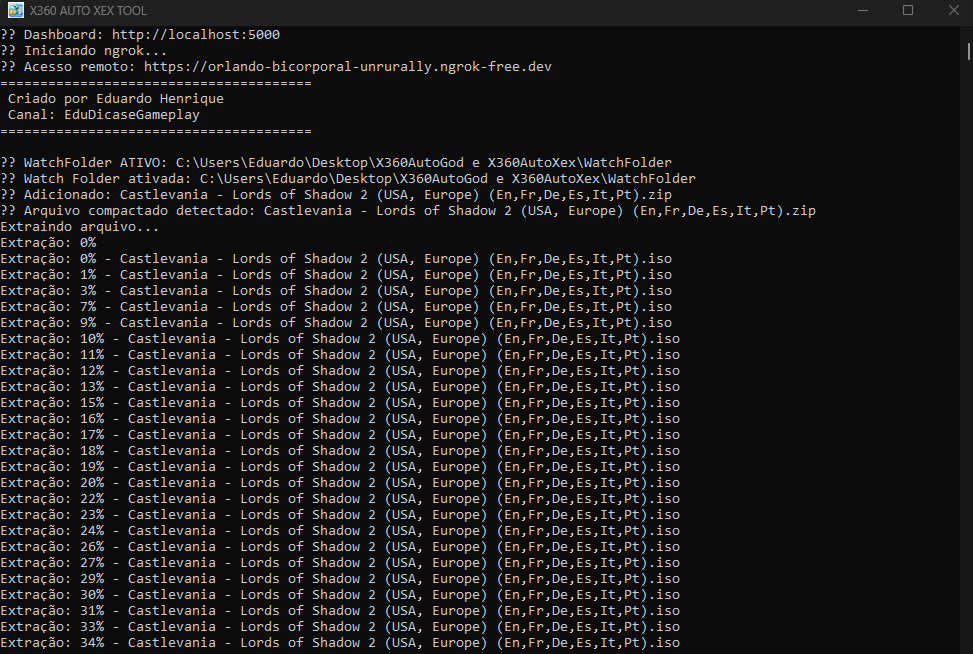
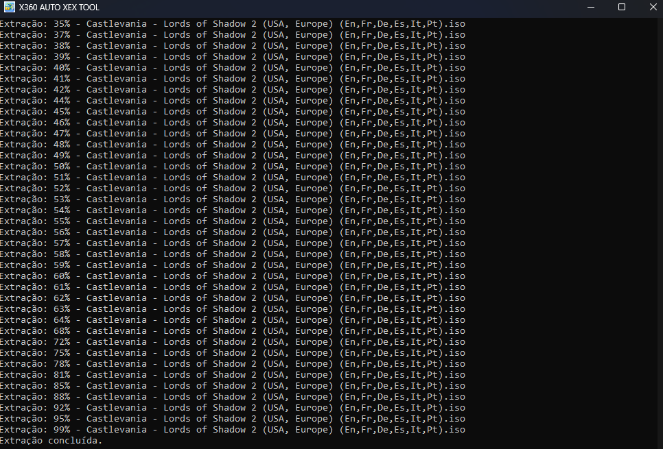
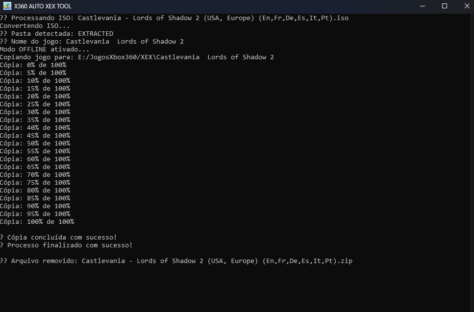

# 🎮 X360AutoGod e X360AutoXex

Ferramenta automatizada para processamento de jogos de Xbox 360 nos formatos **ISO, XEX, XBE e GOD**, com suporte a **MULTIDISK inteligente**, envio via **FTP**, cópia offline e **dashboard em tempo real via navegador**.

---

## 📸 Interface

<p align="center">
  
</p>

<p align="center">
  
</p>

<p align="center">
  
</p>

---

## 📦 Projetos incluídos

* `X360AutoXex.exe` → Conversão e envio em formato **XEX/XBE**
* `X360AutoGod.exe` → Conversão e envio em formato **GOD (Games on Demand)**

---

## 🚀 Funcionalidades

* ✔ Processamento automático de:

  * ISOs
  * Jogos extraídos (XEX / XBE)
  * Jogos GOD (Games on Demand)

* ✔ Suporte a arquivos compactados:

  `.zip`, `.7z`, `.rar`, `.tar`, `.gz`, `.bz2`, `.xz`

* ✔ Suporte **MULTIDISK Inteligente**

  Detecta automaticamente:

  * Disc 1 / Disc 2
  * DVD1 / DVD2
  * CD1 / CD2

* ✔ **Watch Folder automática**

* ✔ Sistema de fila inteligente

  Evita duplicação e conflitos durante o processamento

* ✔ Envio via **FTP** ou cópia **offline**

* ✔ **Dashboard Web em tempo real (WebSocket)**

* ✔ Histórico de processamento

* ✔ Identificação automática de jogos via `games.json`

* ✔ Acesso remoto via **ngrok**

* ✔ Botão para desligamento remoto do PC

---

## ⚙️ Pré-requisitos

* Windows 10 ou superior
* .NET 6 ou superior

### 📁 Pasta `tools` obrigatória

* `7za.exe` → Extração de arquivos
* `extract-xiso.exe` → Conversão ISO → XEX
* `iso2god.exe` → Conversão ISO → GOD
* `WinSCP.com` → Envio via FTP
* `ngrok.exe` → Dashboard remoto (opcional)

---

# 🎮 Banco de Dados de Jogos

Suporte a identificação automática de jogos usando `games.json`.

Exemplo:

```json
{
  "4D5307FA": "Lost Odyssey",
  "545408A7": "Halo Reach"
}
```

Usado para:

* Nome amigável dos jogos
* Logs mais organizados
* Melhor identificação no dashboard

---

## 📝 Configuração (`config.ini`)

```ini
# ==========================================
# FTP
# ==========================================

ftp=true
ip=192.168.1.15
user=xboxftp
password=xboxftp

DEST=/Hdd1/Content/0000000000000000/
DEST_XEX=/Hdd1/MeusXEX/
DEST_XBE=/Hdd1/MeusClassicos/
DEST_TU_CACHE=/Hdd1/Cache/

# ==========================================
# MODO OFFLINE
# ==========================================

DEST_OFF=E:/JogosXbox360/

# ==========================================
# WATCH FOLDER
# ==========================================

WATCH_FOLDER=true
WATCH_FOLDER_PATH=WatchFolder

# ==========================================
# MULTIDISK
# ==========================================

MULTIDISK=true
MULTIDISK_FOLDER=Multidisk_GOD
```

---

## ▶️ Como usar

1. Coloque os arquivos na pasta do programa ou na Watch Folder
2. Execute:

```bash
X360AutoXex.exe
```

ou

```bash
X360AutoGod.exe
```

3. Acompanhe pelo CMD ou pelo dashboard:

```txt
http://localhost:5000
```

---

## 🌐 Dashboard

O dashboard permite acompanhar tudo em tempo real:

* Progresso de conversão
* Extração de arquivos
* Upload FTP
* Status atual
* Histórico de processamento
* Controle remoto do sistema

---

## ⚠️ Observações

* Processamento em fila (**1 jogo por vez**)
* Limpeza automática de arquivos temporários
* Sistema otimizado para uso contínuo
* Suporte a múltiplos formatos
* Funcionamento totalmente automático após configuração

---

# 🔥 Diferenciais

Diferente de ferramentas tradicionais da cena Xbox 360, o X360AutoGod/Xex automatiza praticamente todo o fluxo:

* Extração
* Conversão
* Organização
* Upload
* Monitoramento
* Limpeza automática
* MULTIDISK
* Dashboard remoto

Tudo em um único sistema automatizado.

---

# 👨‍💻 Desenvolvido por

**Eduardo Henrique**
Canal: **Edu Dicas e Gameplay**

---

# 📜 Licença

Projeto desenvolvido para preservação, automação e facilidade no gerenciamento de jogos de Xbox 360.